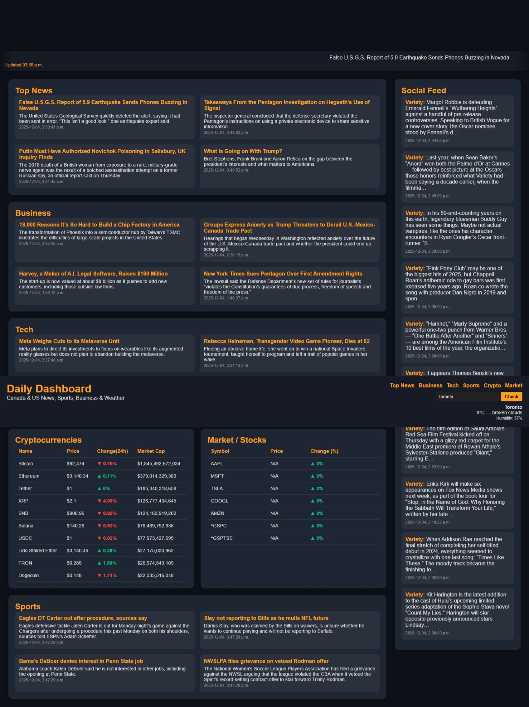

# 📊 Daily Dashboard

A customizable **personal dashboard** built with **Node.js + Express**, providing real-time data for weather, crypto markets, stocks, news, and entertainment feeds — all in one clean and responsive interface.

---

## 🚀 Features

### 🌦 Weather Module
- Real-time current weather for any city  
- Temperature, humidity, and conditions  
- Powered by **OpenWeather API**

### 💰 Crypto Market Tracker
- Top 10 cryptocurrencies  
- Prices, market caps, and 24h change  
- Powered by **CoinGecko API**

### 📰 News Aggregation
- Pulls RSS feeds from:  
  - New York Times (Home, Business, Tech)  
  - ESPN & CBS Sports  
- Sorted by recent publish time  
- Shows top 10 curated articles  

### 🎭 Social / Entertainment Feed
- Aggregated from:  
  - Variety  
  - Hollywood Reporter  
- Unified, timestamp-sorted list  

### 📈 Stocks Module
- Real-time quotes for:  
  - AAPL, MSFT, TSLA, GOOGL, AMZN  
  - S&P 500 (^GSPC)  
  - TSX Composite (^GSPTSE)  
- Powered by **Finnhub API**

---

## 📁 Project Structure
```
/public            → Frontend static files (HTML/CSS/JS)
server.js          → Express server + API routes
package.json
.env               → API keys (not committed)
```

---

## 🔌 API Endpoints

### Weather  
`GET /api/weather?city=Ottawa`

### Crypto  
`GET /api/crypto`

### News  
`GET /api/news?category=general`  
Categories: `general`, `business`, `tech`, `sports`

### Social  
`GET /api/social`

### Stocks  
`GET /api/stocks`

---

## 🛠 Installation & Setup

### 1. Clone the repo
```bash
git clone https://github.com/your-username/daily-dashboard.git
cd daily-dashboard
```

### 2. Install dependencies
```bash
npm install
```

### 3. Add environment variables
Create `.env` file:
```
OPENWEATHER_API_KEY=your_key_here
FINNHUB_API_KEY=your_key_here
```

### 4. Start the server
```bash
npm start
```

Server runs at:  
**http://localhost:5000**

---

## 🖼 Screenshots

> Create a `/screenshots` folder at the root of your project and add the images below.


### 3. News, Business, Tech, Crypto Market, sports & Social Feed  


---

## 📚 Tech Stack
- **Node.js / Express**  
- **RSS-Parser**  
- **node-fetch**  
- External APIs: OpenWeather, CoinGecko, Finnhub

---

## 🔒 Environment Variables Required
| Key | Description |
|------|-------------|
| `OPENWEATHER_API_KEY` | Weather data |
| `FINNHUB_API_KEY` | Stock market data |

---

## 🧩 Future Enhancements
- User preferences  
- Dark/light mode  
- Cached API responses  
- Additional widgets (calendar, tasks, reminders)

